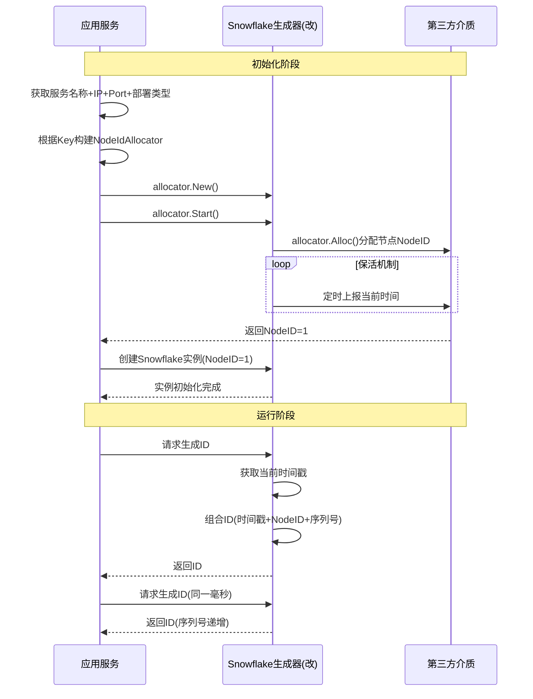

# 最终推荐建议及优化点

​	美团Leaf和百度Uid虽然各方面不弱但我们所有项目都是Go语言，在语言方面亲和Golang，如需使用则需要把id生成封装成微服务不管是gRPC还是Http性能都会大打折扣，故 基于Bwmarrin Snowflake优化。

Bwmarrin Snowflake仍有缺点，需要解决额外问题。


## 问题1：NodeId防撞车

**方案1 服务名称+IP+Port+部署类型**

尽量减少开发者使用成本，不必规划，利用约定大于配置

**原则**：重新启动前后尽量不变

| 字段         | 名称       | 解释                                |
| ------------ | ---------- | ----------------------------------- |
| type         | 部署类型   | 服务部署的介质。物理机，Docker，K8s |
| ip           | IP地址     | -                                   |
| port         | 端口号     | -                                   |
| service_name | 微服务名称 | -                                   |

根据部署类型获得唯一Key

**Key的结构**：{service_name}:{ip}:{port}:{type}


|                 Key                 | Value                        |
|:-----------------------------------:|------------------------------|
| n_{service_name}:{ip}:{port}:{type} | {"nodeId":123,"expire":time} |
|                                     |                              |


| 部署类型        | key的组成                 | 描述                    |
|-------------|------------------------|-----------------------|
| **物理机**     | ip, port，service_name  | 多机部署ip是变量，单机部署port是变量 |
| **Docker**  | ip, port, service_name | 多机部署ip是变量，单机部署port是变量 |
| **K8s pod** | ip, port, service_name | k8s每个pod的ip都不一样       |

通过计算Key得出结果求模1024得出`nodeId`

**方案2 服务名称+IP+Port+类型 引入第三方介质**


通过统一接口分配NodeId

```go
type NodeIdAllocator interface{
    Alloc()(nodeId string, err error)
}
```

通过引入第三方介质 etcd, Zookeeper, 注册中心, 数据库等，通过注册Key得到`nodeId`

```
// 例如：EtcdNodeIdAllocator, ZookeeperNodeIdAllocator, MySQLNodeIdAllocator等...
type EtcdNodeIdAllocator struct
type ZookeeperNodeIdAllocator等 struct
```


## 问题2：重启后检查时间回拨

因**单调时钟**特性我们只需重启后的时间回拨即可

这个问题在不引入第三方介质无法解决，基于**问题1 方案2**所引入的第三方介质，定时上报最新时间将time放在value中

|                 Key                 | Value                     |
| :---------------------------------: | ------------------------- |
| t_{service_name}:{ip}:{port}:{type} | Current time milliseconds |
|                                     |                           |


> 基于servicecommon现有架构除IP外 其他信息health组件都可以提供


```go
var ErrTimeRollback = errors.New("Time Rollback")

type NodeIdAllocator interface{
    Alloc()(nodeId int64, err error)
}
```

### 时序图（改）





### 新问题1：自动漂移（冲突时）

当出现Key冲突时自动计算或线性生成新的`nodeId`

### 新问题2：保活机制

注册/与注销

```go
package snowflake

import (
	"context"
	"time"
	
	"github.com/zeromicro/go-zero/core/logx"
)

// NodeIdAllocator 节点id分配器
type NodeIdAllocator interface {
	Alloc() (nodeId int64, err error)
	Commit(currment time.Time) error
}

// Starter is the interface wraps the Start method.
type Starter interface {
	Start()
}

// Stopper is the interface wraps the Stop method.
type Stopper interface {
	Stop()
}

// Registrar 复杂场景可以在添加一层接口来提供保活机制
type Registrar interface {
	Register(context.Context) error
	Unregister(context.Context) error
	GetNodeIdAllocator() (NodeIdAllocator, error)
}

type ZookeeperNodeIdAllocator struct {
	Registrar
}

func (z *ZookeeperNodeIdAllocator) Stop() {
	err := z.Unregister(context.Background())
	if err != nil {
		logx.Error(err)
	}
}

func (z *ZookeeperNodeIdAllocator) Start() {
	err := z.Register(context.Background())
	if err != nil {
		logx.Error(err)
	}
}

func (z *ZookeeperNodeIdAllocator) Alloc() (nodeId int64, err error) {
 allocator, err := z.GetNodeIdAllocator()
	if err != nil {
		return 0, err
	}
	return allocator.Alloc()
}
```

## MySQL分配器实现

